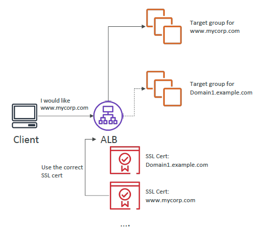

# SSL 
- The load balancer uses an X.509 certificate
- Certificates can be managed using ACM (AWS Certificate Manager)

# SNI Server Name Indication
- SNI solves the problem of loading multiple SSL certificates onto one web server.
- Only works for ALB, NLB, CloudFront
- Not for CLB
