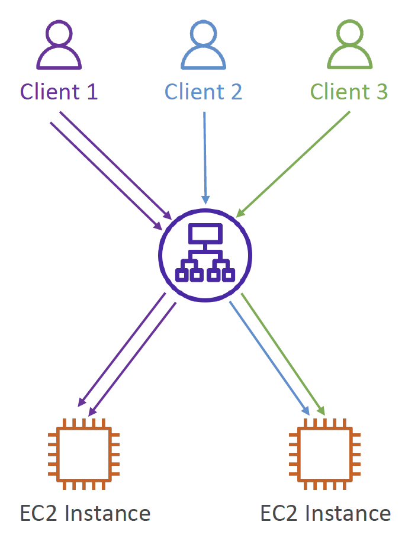

# Sticky Sessions

- It is possible to implement stickiness so that the same client is always redirected to the same instance behind a load balancer
- Works for: Classic LB, Application LB and Network LB
- 
- The "cookie" has expiration date
- Use case: User does not lose session data
- Disadvantage: Creates imbalance 

# Cookie Names

- Application-Based Cookies
	- Custom cookie
		- Generated by the target
		- Name must be specified individually for each target group
		- Don't use: AWSALB, AWSALBAPP, AWSALBTG (Reserved)
	- Application cookie
		- Generated by LB
		- Name: AWSALBAPP
- Duration-based Cookies
	- Generated by LB
	- Name: AWSALB for ALB, AWSELB for CLB